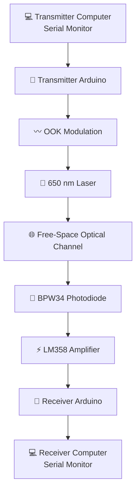

## 📌 Project Overview

This project presents a **low-cost Free Space Optical (FSO) communication prototype** capable of transmitting text data through open air using a modulated **650 nm laser beam**.

The transmitter uses an **Arduino Uno** to process text entered through a Serial Monitor and control the laser using **On-Off Keying (OOK)**. At the receiver, a **BPW34 photodiode** detects the optical signal, while an **LM358 operational amplifier** amplifies the weak electrical signal before it is processed by a second Arduino Uno.

The recovered message is finally displayed on the receiver computer through the Arduino Serial Monitor.

---

## ✨ Key Features

- 🔴 650 nm laser-based optical transmitter
- 📡 Point-to-point free-space optical communication
- 💡 On-Off Keying (OOK) digital modulation
- 🔬 BPW34 photodiode optical receiver
- ⚡ LM358-based signal amplification
- 🔌 Two Arduino Uno boards for processing
- 💻 Serial Monitor based text transmission
- 📏 Indoor communication testing up to approximately **8 m**
- 🧪 Low-cost prototype using readily available components
- 🛠️ Designed primarily for educational and prototyping purposes

---

# 🔬 About Free Space Optical Communication

Free Space Optical communication transfers information through **light propagating through free space**, rather than using a conventional radio-frequency wireless channel.
FSO systems are attractive because optical beams can provide highly directional communication and can avoid electromagnetic interference associated with conventional RF links.

The same general physical principle is relevant to more advanced optical communication systems, including terrestrial, satellite, and deep-space optical links.

> **Important:** The advanced applications mentioned in the project report are discussed as potential applications of the underlying technology. They are **not capabilities demonstrated by this prototype**.

---

# 🧩 System Architecture

The complete communication chain is:


# ⚙️ How It Works



📄 Detailed architecture:

[`docs/system-architecture.md`](docs/system-architecture.md)


# 🛠️ Hardware

| Component           |   Qty.  | Function                                   |
| ------------------- | :-----: | ------------------------------------------ |
| Arduino Uno         |    2    | Transmitter and receiver processing        |
| 650 nm Laser Module |    1    | Optical transmitter                        |
| BPW34 Photodiode    |    1    | Optical receiver                           |
| LM358 Op-Amp        |    1    | Signal amplification                       |
| NPN Transistor      |    1    | Laser switching / driver                   |
| Resistors           | Various | Biasing, current limiting and gain setting |
| Breadboard          |    1    | Circuit prototyping                        |
| Jumper Wires        | Various | Electrical connections                     |
| Power Adapter       |    1    | Approximately 5 V / 2 A system power       |

---

## 🔧 Hardware Setup

### Transmitter

The transmitter consists primarily of:

```text
Computer
   ↓
Arduino Uno
   ↓
SoftwareSerial
   ↓
NPN Transistor Driver
   ↓
650 nm Laser
```

### Receiver

The receiver consists primarily of:

```text
650 nm Laser Beam
       ↓
BPW34 Photodiode
       ↓
LM358 Amplifier
       ↓
Arduino Uno
       ↓
Computer
```

---

# 🖼️ Project Setup


---

# 🔌 Circuit Connections

### Transmitter

Detailed transmitter connections:

👉 [`hardware/transmitter-connections.md`](hardware/transmitter-connections.md)

### Receiver

Detailed receiver connections:

👉 [`hardware/receiver-connections.md`](hardware/receiver-connections.md)

---

# 💻 Software

The project uses:

| Software / Technology  | Purpose                                 |
| ---------------------- | --------------------------------------- |
| Arduino IDE            | Programming and uploading sketches      |
| C/C++                  | Arduino programming language            |
| SoftwareSerial         | Additional serial communication channel |
| Arduino Serial Monitor | User input and recovered output         |

### Arduino Source Code

#### 🔴 Transmitter

[`arduino/transmitter/transmitter.ino`](arduino/transmitter/transmitter.ino)

#### 🔵 Receiver

[`arduino/receiver/receiver.ino`](arduino/receiver/receiver.ino)

---


# 📊 Experimental Results

The prototype was tested indoors under clear line-of-sight conditions.

|  Distance | Observed Performance     |
| --------: | ------------------------ |
| **1–2 m** | 🟢 Excellent             |
| **2–3 m** | 🟢 Good / Stable         |
| **3–7 m** | 🟡 Moderate / Some Noise |
| **> 7 m** | 🔴 Degraded              |


### Main Environmental Effects

The report identifies:

* ☀️ Sunlight
* 💡 Artificial light
* 🌫️ Environmental optical interference
* 📐 Transmitter/receiver alignment

as factors affecting the received signal.

Optical shielding and a filtering capacitor were used to reduce some of the observed noise effects.

---

> The above visualization summarizes the qualitative performance categories reported in the FYP report. It is not a newly measured quantitative performance curve.

---

# 🚧 Limitations

The prototype has several practical limitations.

### 1. Line of Sight

The transmitter and receiver require a clear optical path.

### 2. Environmental Conditions

Fog, rain, dust, and other optical disturbances can affect the communication channel.

### 3. Alignment

Because the laser beam is directional, accurate alignment between the transmitter and receiver is important.

### 4. Processing Speed

The communication speed is limited by the timing and processing behavior of the Arduino-based implementation.

### 5. Ambient Light

Sunlight and artificial lighting can introduce unwanted optical signal components at the receiver.

---

# 🚀 Applications & Future Work

The project report discusses several possible directions for the underlying FSO technology.

### Potential Applications

* 🌙 Moon–Earth / Earth–Moon optical communication
* 🛰️ Satellite communication
* 🚀 Space and deep-space communication
* 🔐 Secure / directional optical communication
* 💡 Li-Fi and optical wireless communication
* 🏭 Industrial automation
* 🏥 Optical communication technologies in medical environments

> **Scope clarification:** These are potential applications or future extensions discussed in the report. The current Arduino prototype should not be interpreted as demonstrating these systems.

### Possible Technical Improvements

Future development could investigate:

* Higher-speed optical modulation
* Improved photodiode amplification
* Automatic beam alignment
* Better ambient-light filtering
* Higher-performance optical receivers
* Error detection and correction
* Longer communication distances
* Improved mechanical mounting
* More efficient laser driver circuitry
* Digital signal processing at the receiver

---

# ⚠️ Safety Note

The project uses a visible laser source.

Avoid direct or reflected exposure to the eyes and use appropriate precautions when operating the optical transmitter.

The laser should be handled responsibly and operated only in a controlled experimental environment.

---

# 📖 References

The complete reference list is available here:

👉 [`references/references.md`](references/references.md)

The references include the sources documented in the original FYP report, including Arduino resources, TinkerCAD, component information, and related technical references.

---

# 👨‍🔬 Authors

### BS Physics Final Year Project — Session 2021–25

**Department of Physics**
**Government Graduate College, Sahiwal**

### Project Team

|  # | Name                      |
| -: | ------------------------- |
|  1 | **Arslan Maqsood**        |
|  2 | **Muhammad Talha**        |
|  3 | **Muhammad Sajid**        |
|  4 | **Muhammad Azam Mustafa** |
|  5 | **Muhammad Danish**       |
|  6 | **Sajid Ali**             |

### 👨‍🏫 Supervisor

**Mr. M. Khalid Saleem**

Department of Physics
Government Graduate College, Sahiwal

---

# 🎓 Academic Context

This project was completed as a **BS Physics Final Year Project** and combines concepts from:

```text
Physics
   │
   ├── Optics
   ├── Electromagnetism
   ├── Photodetection
   └── Optical Communication
          │
          ▼
Electronics
   │
   ├── Operational Amplifiers
   ├── Transistor Switching
   ├── Signal Amplification
   └── Photodiodes
          │
          ▼
Embedded Systems
   │
   ├── Arduino
   ├── Serial Communication
   └── Digital Data Processing
```

The project therefore provides a practical connection between **physics, optical communication, electronics, and embedded systems**.

