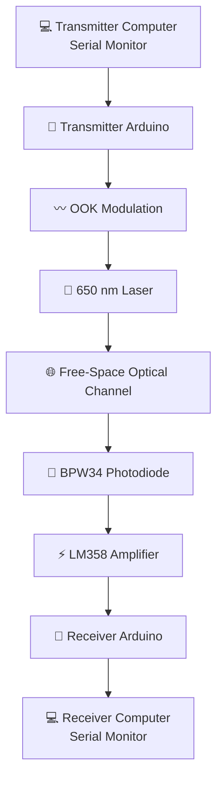

## 📌 Project Overview

This project presents a **low-cost Free Space Optical (FSO) communication prototype** capable of transmitting text data through open air using a modulated **650 nm laser beam**.

The transmitter uses an **Arduino Uno** to process text entered through a Serial Monitor and control the laser using **On-Off Keying (OOK)**. At the receiver, a **BPW34 photodiode** detects the optical signal, while an **LM358 operational amplifier** amplifies the weak electrical signal before it is processed by a second Arduino Uno.

The recovered message is finally displayed on the receiver computer through the Arduino Serial Monitor.

---

## ✨ Key Features

- 🔴 650 nm laser-based optical transmitter
- 📡 Point-to-point free-space optical communication
- 💡 On-Off Keying (OOK) digital modulation
- 🔬 BPW34 photodiode optical receiver
- ⚡ LM358-based signal amplification
- 🔌 Two Arduino Uno boards for processing
- 💻 Serial Monitor based text transmission
- 📏 Indoor communication testing up to approximately **8 m**
- 🧪 Low-cost prototype using readily available components
- 🛠️ Designed primarily for educational and prototyping purposes

---

# 🔬 About Free Space Optical Communication

Free Space Optical communication transfers information through **light propagating through free space**, rather than using a conventional radio-frequency wireless channel.
FSO systems are attractive because optical beams can provide highly directional communication and can avoid electromagnetic interference associated with conventional RF links.

The same general physical principle is relevant to more advanced optical communication systems, including terrestrial, satellite, and deep-space optical links.

> **Important:** The advanced applications mentioned in the project report are discussed as potential applications of the underlying technology. They are **not capabilities demonstrated by this prototype**.

---

# 🧩 System Architecture

The complete communication chain is:


# ⚙️ How It Works



📄 Detailed architecture:

[`docs/system-architecture.md`](docs/system-architecture.md)


# 🛠️ Hardware

| Component           |   Qty.  | Function                                   |
| ------------------- | :-----: | ------------------------------------------ |
| Arduino Uno         |    2    | Transmitter and receiver processing        |
| 650 nm Laser Module |    1    | Optical transmitter                        |
| BPW34 Photodiode    |    1    | Optical receiver                           |
| LM358 Op-Amp        |    1    | Signal amplification                       |
| NPN Transistor      |    1    | Laser switching / driver                   |
| Resistors           | Various | Biasing, current limiting and gain setting |
| Breadboard          |    1    | Circuit prototyping                        |
| Jumper Wires        | Various | Electrical connections                     |
| Power Adapter       |    1    | Approximately 5 V / 2 A system power       |

---

## 🔧 Hardware Setup

### Transmitter

<p align="center">
  
</p>

The transmitter consists primarily of:

```text
Computer
   ↓
Arduino Uno
   ↓
SoftwareSerial
   ↓
NPN Transistor Driver
   ↓
650 nm Laser
```

### Receiver

<p align="center">
  
</p>

The receiver consists primarily of:

```text
650 nm Laser Beam
       ↓
BPW34 Photodiode
       ↓
LM358 Amplifier
       ↓
Arduino Uno
       ↓
Computer
```

---

# 🖼️ Project Setup

<p align="center">
  
</p>

The prototype uses a direct line-of-sight arrangement between the laser transmitter and photodiode receiver.

---

# 🔌 Circuit Connections

### Transmitter

Detailed transmitter connections:

👉 [`hardware/transmitter-connections.md`](hardware/transmitter-connections.md)

### Receiver

Detailed receiver connections:

👉 [`hardware/receiver-connections.md`](hardware/receiver-connections.md)

### Circuit Diagram

<p align="center">
  
</p>

> The original circuit diagram is reproduced from the project report where available. Some wiring labels in the report are inconsistent; see the implementation notes below before physically reproducing the circuit.

---

# 💻 Software

The project uses:

| Software / Technology  | Purpose                                 |
| ---------------------- | --------------------------------------- |
| Arduino IDE            | Programming and uploading sketches      |
| C/C++                  | Arduino programming language            |
| SoftwareSerial         | Additional serial communication channel |
| Arduino Serial Monitor | User input and recovered output         |

### Arduino Source Code

#### 🔴 Transmitter

[`arduino/transmitter/transmitter.ino`](arduino/transmitter/transmitter.ino)

#### 🔵 Receiver

[`arduino/receiver/receiver.ino`](arduino/receiver/receiver.ino)

The sketches are reproduced from the report's Program Code section with explanatory comments added.

---

# 📡 Communication Demonstration

A typical transmission follows:

```text
TRANSMITTER                         RECEIVER

Serial Monitor                     Serial Monitor
      │                                   ▲
      │                                   │
      ▼                                   │
   "HELLO"                                │
      │                                   │
      ▼                                   │
 Arduino Uno                             │
      │                                   │
      ▼                                   │
 OOK Modulation                           │
      │                                   │
      ▼                                   │
 650 nm Laser  ───────────────►  BPW34
                                  │
                                  ▼
                              LM358
                                  │
                                  ▼
                           Receiver Arduino
                                  │
                                  ▼
                              "HELLO"
```

### Example

```text
Transmitter Serial Monitor

Enter message: HELLO
Sending: HELLO
```

Receiver:

```text
Received: HELLO
```

---

# 📊 Experimental Results

The prototype was tested indoors under clear line-of-sight conditions.

|  Distance | Observed Performance     |
| --------: | ------------------------ |
| **1–2 m** | 🟢 Excellent             |
| **2–3 m** | 🟢 Good / Stable         |
| **3–7 m** | 🟡 Moderate / Some Noise |
| **> 7 m** | 🔴 Degraded              |

### Tested Messages

The report documents successful transmission and reception of:

```text
HELLO
12345678
Laser
```

### Main Environmental Effects

The report identifies:

* ☀️ Sunlight
* 💡 Artificial light
* 🌫️ Environmental optical interference
* 📐 Transmitter/receiver alignment

as factors affecting the received signal.

Optical shielding and a filtering capacitor were used to reduce some of the observed noise effects.

---

# 📈 Distance Performance

```text
Communication Quality

1–2 m     ████████████████████  Excellent
2–3 m     █████████████████    Good
3–7 m     ███████████          Moderate
>7 m      ██████               Degraded
```

> The above visualization summarizes the qualitative performance categories reported in the FYP report. It is not a newly measured quantitative performance curve.

---

# 🧪 Experimental Setup

<p align="center">
  
</p>

The communication test was performed by maintaining a line of sight between the laser transmitter and photodiode receiver and increasing the separation distance.

---

# 🚧 Limitations

The prototype has several practical limitations.

### 1. Line of Sight

The transmitter and receiver require a clear optical path.

### 2. Environmental Conditions

Fog, rain, dust, and other optical disturbances can affect the communication channel.

### 3. Alignment

Because the laser beam is directional, accurate alignment between the transmitter and receiver is important.

### 4. Processing Speed

The communication speed is limited by the timing and processing behavior of the Arduino-based implementation.

### 5. Ambient Light

Sunlight and artificial lighting can introduce unwanted optical signal components at the receiver.

---

# 🚀 Applications & Future Work

The project report discusses several possible directions for the underlying FSO technology.

### Potential Applications

* 🌙 Moon–Earth / Earth–Moon optical communication
* 🛰️ Satellite communication
* 🚀 Space and deep-space communication
* 🔐 Secure / directional optical communication
* 💡 Li-Fi and optical wireless communication
* 🏭 Industrial automation
* 🏥 Optical communication technologies in medical environments

> **Scope clarification:** These are potential applications or future extensions discussed in the report. The current Arduino prototype should not be interpreted as demonstrating these systems.

### Possible Technical Improvements

Future development could investigate:

* Higher-speed optical modulation
* Improved photodiode amplification
* Automatic beam alignment
* Better ambient-light filtering
* Higher-performance optical receivers
* Error detection and correction
* Longer communication distances
* Improved mechanical mounting
* More efficient laser driver circuitry
* Digital signal processing at the receiver

---

# 📁 Repository Structure

```text
free-space-optical-communication-arduino/
│
├── 📄 README.md
├── 📄 LICENSE
├── 📄 .gitignore
│
├── 📂 docs/
│   ├── 📄 project-report.pdf
│   ├── 📄 project-overview.md
│   ├── 📄 system-architecture.md
│   └── 📄 results.md
│
├── 📂 arduino/
│   │
│   ├── 📂 transmitter/
│   │   └── 📄 transmitter.ino
│   │
│   └── 📂 receiver/
│       └── 📄 receiver.ino
│
├── 📂 hardware/
│   ├── 📄 components.md
│   ├── 📄 transmitter-connections.md
│   ├── 📄 receiver-connections.md
│   └── 📂 circuit-diagram/
│
├── 📂 images/
│   ├── 📂 project/
│   ├── 📂 circuit/
│   ├── 📂 hardware/
│   └── 📂 results/
│
└── 📂 references/
    └── 📄 references.md
```

---

# 🔍 Implementation Notes & Report Clarifications

The original FYP report contains several internal inconsistencies.

Rather than silently changing the reported information, this repository documents those inconsistencies so that anyone attempting to reproduce the project can verify the hardware and connections.

<details>
<summary><b>🔧 Transistor Part Number</b></summary>

The report contains two different transistor designations:

* Table 2.1 → **2N2222**
* Section 2.1.5 → **2N2222**
* Section 3.3.1 → **BC547**
* Circuit diagram → **BC547**

The report does not definitively establish which transistor was physically used.

See:

[`hardware/components.md`](hardware/components.md)

</details>

<details>
<summary><b>🔌 Receiver Arduino Pin</b></summary>

The written wiring description identifies Arduino Digital Pin 2 as the input from the LM358 output, which is consistent with:

```cpp
SoftwareSerial(2, 3)
```

However, the circuit diagram labels the connection as Digital Pin 8.

See:

[`hardware/receiver-connections.md`](hardware/receiver-connections.md)

</details>

<details>
<summary><b>🔴 Transmitter Drive Pin</b></summary>

The written wiring description refers generally to the Arduino data pin.

The circuit diagram identifies Digital Pin 9.

However, the transmitter code uses the `SoftwareSerial` TX connection on pin 3.

See:

[`hardware/transmitter-connections.md`](hardware/transmitter-connections.md)

</details>

<details>
<summary><b>🔩 Resistor Values</b></summary>

The summary component table lists:

```text
1 kΩ
10 kΩ
220 Ω
```

The detailed wiring section additionally mentions:

```text
10–47 Ω emitter resistor
100 kΩ feedback resistor
```

These values should therefore be checked against the physical prototype before reproduction.

See:

[`hardware/components.md`](hardware/components.md)

</details>

<details>
<summary><b>📘 Project Title</b></summary>

The report uses slightly different wording in different sections:

**Cover page:**

> Free Space Optical Communication System Using Laser Diode and Arduino

**Certificate page:**

> Free Space Optical Communication System Using Laser Module and Arduino

This repository follows the cover-page title.

</details>

---

# 📚 Documentation

| Document                                                            | Description                             |
| ------------------------------------------------------------------- | --------------------------------------- |
| [`project-report.pdf`](docs/project-report.pdf)                     | Complete FYP report                     |
| [`project-overview.md`](docs/project-overview.md)                   | Problem statement, objectives and scope |
| [`system-architecture.md`](docs/system-architecture.md)             | Communication architecture              |
| [`results.md`](docs/results.md)                                     | Experimental results and discussion     |
| [`components.md`](hardware/components.md)                           | Hardware components                     |
| [`transmitter-connections.md`](hardware/transmitter-connections.md) | Transmitter wiring                      |
| [`receiver-connections.md`](hardware/receiver-connections.md)       | Receiver wiring                         |
| [`references.md`](references/references.md)                         | Project references                      |

---

# ▶️ Getting Started

## Requirements

### Hardware

* 2 × Arduino Uno
* 1 × 650 nm laser module
* 1 × BPW34 photodiode
* 1 × LM358 op-amp
* 1 × NPN transistor
* Resistors
* Breadboard
* Jumper wires
* Power supply
* Two computers with Arduino IDE / Serial Monitor

### Software

* Arduino IDE
* Arduino `SoftwareSerial` library

---

## Installation

### Step 1 — Clone the Repository

```bash
git clone https://github.com/YOUR-USERNAME/free-space-optical-communication-arduino.git
```

### Step 2 — Open the Transmitter Code

```text
arduino/
└── transmitter/
    └── transmitter.ino
```

Open the sketch in Arduino IDE.

### Step 3 — Upload to the Transmitter Arduino

Connect the first Arduino Uno and upload:

```text
transmitter.ino
```

### Step 4 — Upload Receiver Code

Connect the second Arduino Uno and upload:

```text
receiver.ino
```

### Step 5 — Assemble the Hardware

Follow the documented wiring:

* [`Transmitter Connections`](hardware/transmitter-connections.md)
* [`Receiver Connections`](hardware/receiver-connections.md)

### Step 6 — Align the Laser

Place the transmitter and receiver so that the laser beam is directed toward the BPW34 photodiode.

### Step 7 — Open Serial Monitors

Open the Serial Monitor on both computers.

Enter a message on the transmitter side and observe the recovered message at the receiver.

---

# ⚠️ Safety Note

The project uses a visible laser source.

Avoid direct or reflected exposure to the eyes and use appropriate precautions when operating the optical transmitter.

The laser should be handled responsibly and operated only in a controlled experimental environment.

---

# 📖 References

The complete reference list is available here:

👉 [`references/references.md`](references/references.md)

The references include the sources documented in the original FYP report, including Arduino resources, TinkerCAD, component information, and related technical references.

---

# 👨‍🔬 Authors

### BS Physics Final Year Project — Session 2021–25

**Department of Physics**
**Government Graduate College, Sahiwal**

### Project Team

|  # | Name                      |
| -: | ------------------------- |
|  1 | **Arslan Maqsood**        |
|  2 | **Muhammad Talha**        |
|  3 | **Muhammad Sajid**        |
|  4 | **Muhammad Azam Mustafa** |
|  5 | **Muhammad Danish**       |
|  6 | **Sajid Ali**             |

### 👨‍🏫 Supervisor

**Mr. M. Khalid Saleem**

Department of Physics
Government Graduate College, Sahiwal

---

# 🎓 Academic Context

This project was completed as a **BS Physics Final Year Project** and combines concepts from:

```text
Physics
   │
   ├── Optics
   ├── Electromagnetism
   ├── Photodetection
   └── Optical Communication
          │
          ▼
Electronics
   │
   ├── Operational Amplifiers
   ├── Transistor Switching
   ├── Signal Amplification
   └── Photodiodes
          │
          ▼
Embedded Systems
   │
   ├── Arduino
   ├── Serial Communication
   └── Digital Data Processing
```

The project therefore provides a practical connection between **physics, optical communication, electronics, and embedded systems**.

---

# 📌 Project Status

```text
Project Type       : Academic / Educational Prototype
Communication      : Free-Space Optical
Optical Source     : 650 nm Laser
Modulation         : On-Off Keying (OOK)
Receiver           : BPW34 Photodiode
Amplifier          : LM358
Controller         : Arduino Uno ×2
Test Environment   : Indoor / Line of Sight
Reported Distance  : Approximately 8 m
Data Type          : Text
Status              : Completed FYP Prototype
```

---

# 📄 License

This project is released under the **MIT License**.

See [`LICENSE`](LICENSE) for the complete license text.

---

<p align="center">

### 🔴 Light → Data → Distance

<b>A simple optical communication concept implemented as a practical physics prototype.</b>

<br><br>

⭐ If this project is useful for your research or learning, consider starring the repository.

</p>

---

<p align="center">
  <sub>
    Free Space Optical Communication System • BS Physics FYP • Government Graduate College, Sahiwal
  </sub>
</p>
```

### A few important improvements I recommend

For the **best-looking GitHub page**, don't put every photo directly into the README. Use the README as the presentation layer and keep the detailed photographs in `images/`.

Your most important images should be:

1. **`images/project/fso-hero.png`** — the banner/hero image.
2. **`images/project/complete-setup.jpg`** — full transmitter-to-receiver setup.
3. **`images/hardware/transmitter.jpg`** — transmitter close-up.
4. **`images/hardware/receiver.jpg`** — receiver close-up.
5. **`images/circuit/circuit-diagram.png`** — circuit diagram.
6. **`images/results/serial-output.png`** — actual `HELLO → HELLO` transmission.
7. **`images/results/distance-test.png`** — your distance experiment.

**One important point:** I intentionally kept your report's inconsistencies documented rather than "fixing" them in the README. That makes the repository more academically credible and reproducible, especially if a professor or researcher checks the GitHub project against the original FYP report.
